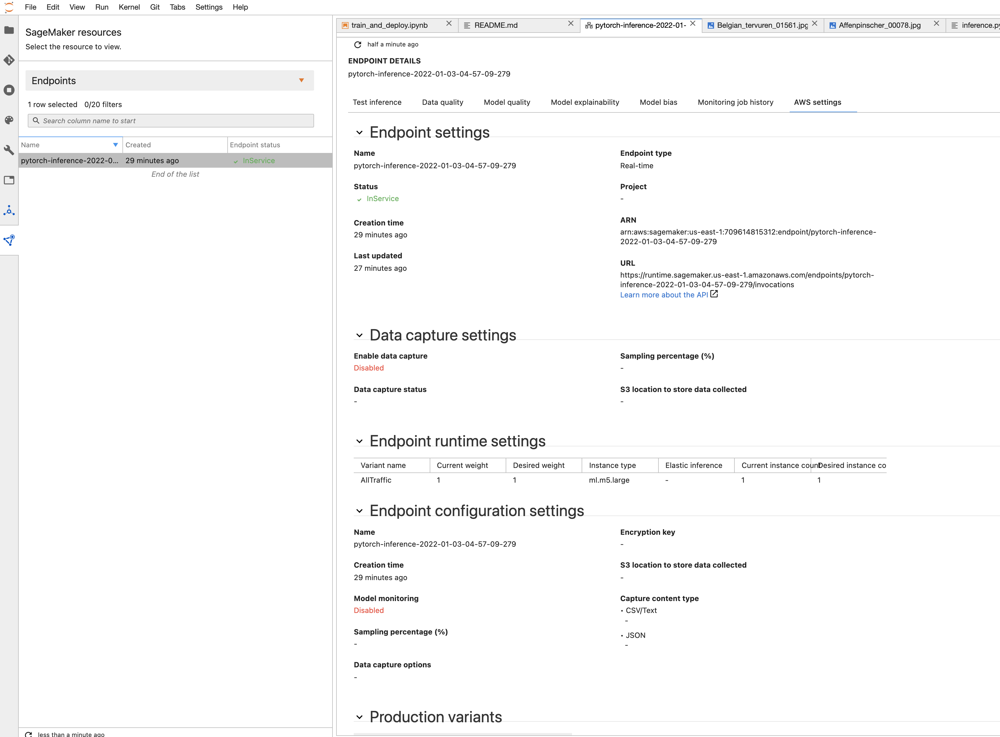

# Image Classification using AWS SageMaker

Use AWS Sagemaker to train a pretrained model that can perform image classification by using the Sagemaker profiling, debugger, hyperparameter tuning and other good ML engineering practices. This can be done on either the provided dog breed classication data set or one of your choice.

## Project Set Up and Installation
Enter AWS through the gateway in the course and open SageMaker Studio. 
Download the starter files.
Download/Make the dataset available. 

## Dataset
The provided dataset is the dogbreed classification dataset which can be found in the classroom.
The project is designed to be dataset independent so if there is a dataset that is more interesting or relevant to your work, you are welcome to use it to complete the project.

### Access
Upload the data to an S3 bucket through the AWS Gateway so that SageMaker has access to the data. 

## Hyperparameter Tuning
I chose ResNet-18 because it is fast and gives good results. 
The hyperparameters I have tuned were:
- learning rate 
- batch size
- epochs

```
hyperparameter_ranges = {
    "lr": ContinuousParameter(0.1, 0.11),
    "batch-size": CategoricalParameter([16, 32]),
    "epochs": IntegerParameter(1, 2)
}
```

I tuned to maximize the average test accuracy with the following. 
```
objective_metric_name = "average test accuracy"
objective_type = "Maximize"
metric_definitions = [{"Name": "average test accuracy", "Regex": "Test set: Average accuracy: ([0-9\\.]+)"}]
```

**Training Jobs:**


**Best Hyperparameters:**


- Tune at least two hyperparameters
- Retrieve the best best hyperparameters from all your training jobs

## Debugging and Profiling

First, I made a working model with tuned hyperparameters. Then I imported the rules and configs needed to set up the debugger and profiler. I set the rules and configs according to what I wanted to test, for example, overfit and GPU utilization. After that, I made the required adjustments to `train_model.py` to make my debugger and profiler work. I finally ran it with a new estimator and printed the results. 

### Results
Although I added the rule `LowGPUUtilization` for the profiler, I could not see it in action since I could not afford to run a GPU instance. 
The other rules were tested and passed without any issues. 


## Model Deployment
**TODO**: Give an overview of the deployed model and instructions on how to query the endpoint with a sample input.
The model is deployed at an endpointed named `pytorch-inference-2022-01-03-04-57-09-279` on a `ml.m5.large` instance.
It takes the `content_type` of "image/jpeg" as Tensor binary input and return the classification result, the other `content_type`s are handled with an exception. 
The model automatically resizes the image that is inputted, so there is no need for preprocessing images before querying. 

To query the endpoint, use [Python Pillow](https://pypi.org/project/Pillow/) and io to transform the jpg to Tensor binary and serve it to the endpoint.
```
from PIL import Image
import io
buf = io.BytesIO()
Image.open("dogImages/test/001.Affenpinscher/Affenpinscher_00036.jpg").save(buf, format="JPEG")

response = predictor.predict(buf.getvalue())
```

**ACTIVE ENDPOINT**



## Standout Suggestions
**TODO (Optional):** This is where you can provide information about any standout suggestions that you have attempted.
